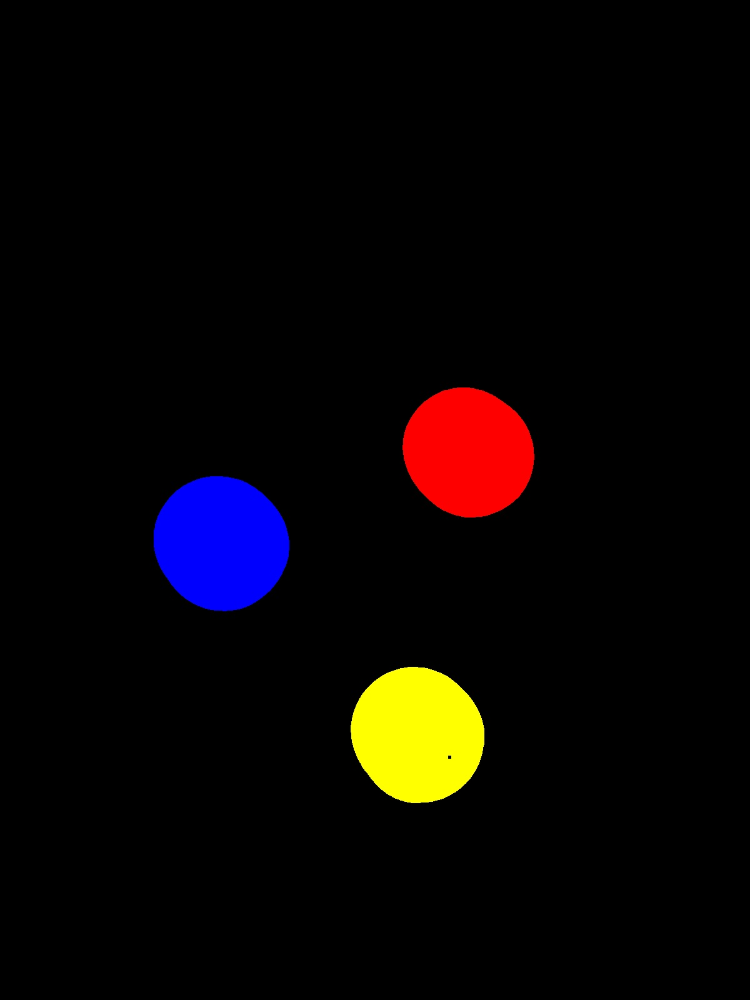

# VR Assignment 1 - Narayana IMT2022052

## Overview

This repository contains two Python scripts for **coin detection** and **image stitching** using OpenCV.

## Repository Structure

- **input_images/**: Contains input images used in the project.
- **output_images/**: Contains the output images
- **scripts/**: Contain two files : coin\_detection.py – Detects, counts, and segments coins in an image,stitching.py – Stitches two images together to create a panorama.
- **.gitignore**: add your local environment to avoid pushing into your repo
- **requirements.txt**: Lists the dependencies required for running the scripts.

### Installation

To install the required dependencies, run:

```sh
pip install -r requirements.txt
```

---

## Part 1: Coin Detection

### Running the Script

Run the following command to execute the coin detection script:

```sh
python coin_detection.py
```

### Functionality
- Converts the image to grayscale and applies median blur to reduce noise.
- Uses Otsu’s thresholding and morphological closing to segment the coins.
- Extracts contours using cv2.findContours() and highlights detected coins.
- Uses color.label2rgb() to colorize segmented regions and prints the total coin count.
- Saves the detected coins and segmented image in the output/ directory.

### Key Functions Used

- `cv2.medianBlur()` – Applies median filter for noise reduction.
- `cv2.threshold()` – Performs image thresholding using Otsu’s method.
- `cv2.morphologyEx()` – Executes morphological closing for noise removal.
- `skimage.measure.label()` – Assigns unique labels to segmented objects.
- `skimage.color.label2rgb()` – Assigns colors to labeled regions for visualization.
- `cv2.imwrite()` – Saves detected images to the output/ directory.

---

## Part 2: Image Stitching

### Running the Script

Run the following command to execute the image stitching script:

```sh
python stitching.py
```

### Functionality

- Detects keypoints using **SIFT** and matches them using **BFMatcher**.
- Computes a **homography matrix** using **RANSAC** for image alignment.
- Warps the first image to match the second, then blends them together.
- Crops out black regions for a cleaner final panorama.

### Key Functions Used

- `cv2.SIFT_create()` – Initializes the SIFT detector.
- `sift.detectAndCompute()` – Detects keypoints and computes descriptors.
- `cv2.drawKeypoints()` – Visualizes detected keypoints.
- `cv2.BFMatcher()` – Matches keypoints using a brute-force approach.
- `bf.match()` – Finds the best matches between feature descriptors.
- `cv2.drawMatches()` – Draws lines connecting matching keypoints.
- `cv2.findHomography()` – Computes the homography matrix for image transformation.
- `cv2.warpPerspective()` – Warps the first image based on the homography matrix.
- `crop_black_region()` – Crops black regions after warping.
---

## Output

- **Part 1**: Detected coins with segmentation and total count displayed.  
***Detected Coins***
    
***Segmented Coins***  
    
- **Part 2**: Final stitched panorama from the input images.  
  ***Detected KeyPoints***  
  
  
  ***Image Matches***  
  
  ***Final Panorama***
  
  

---

